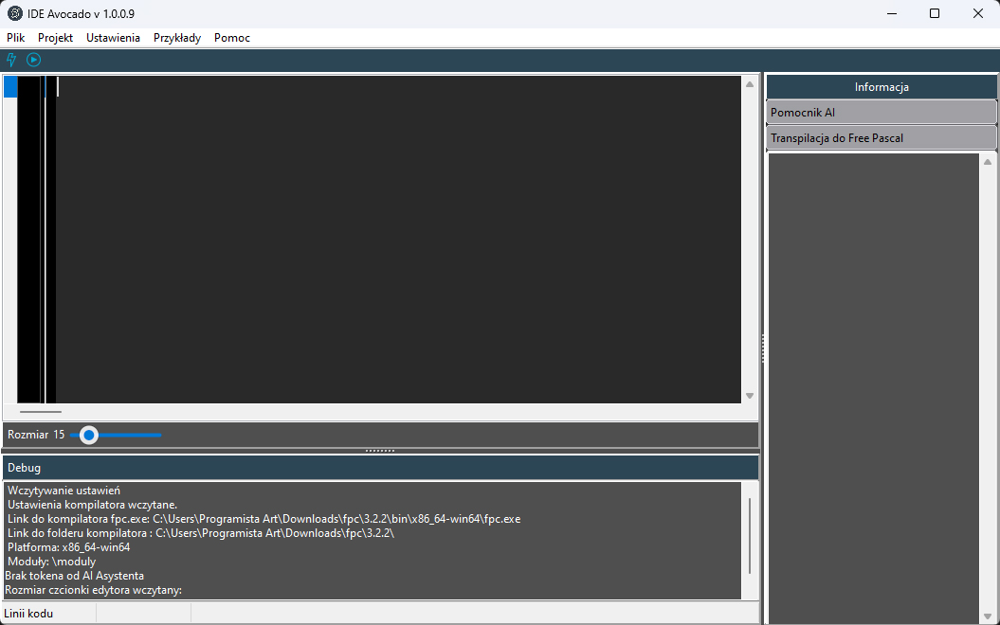
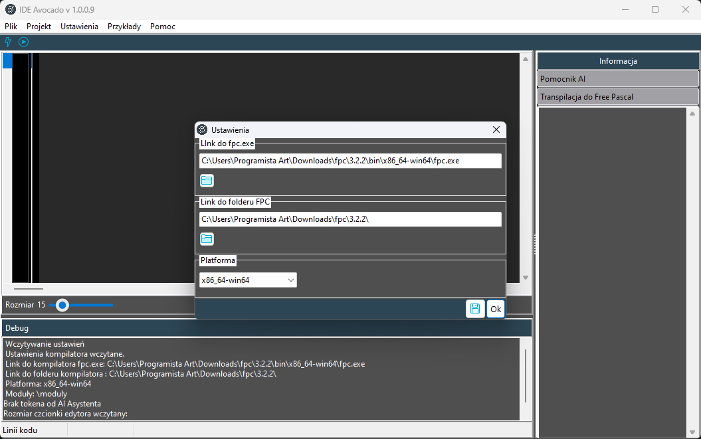
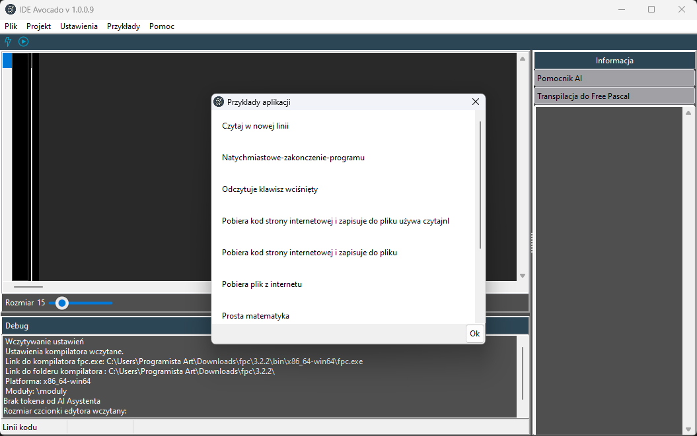
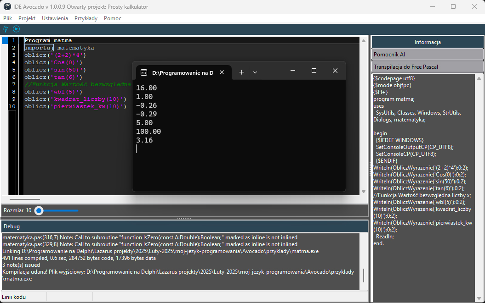
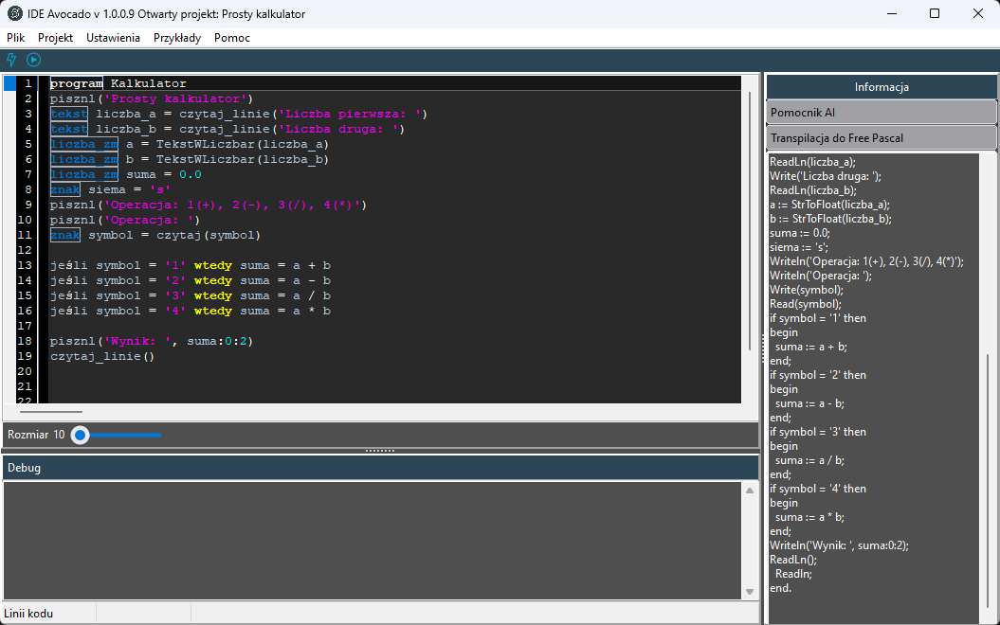
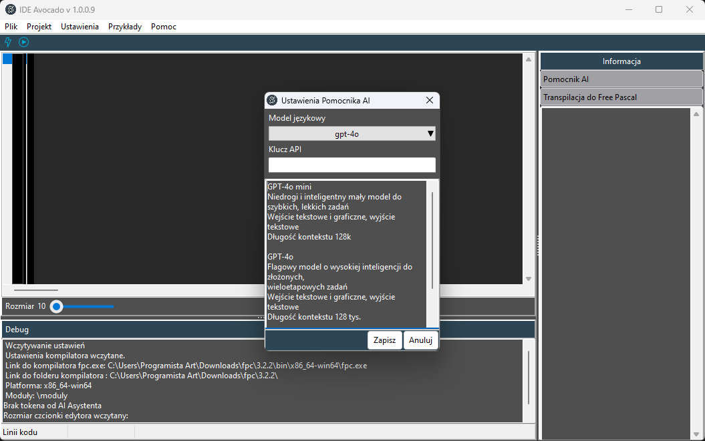
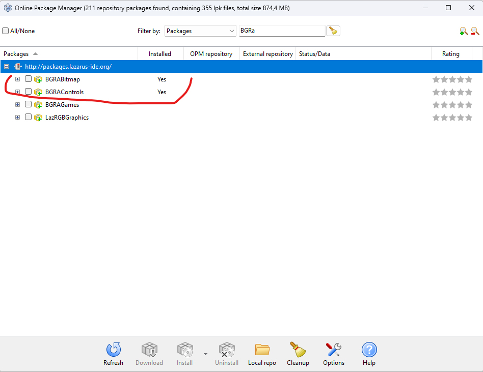

# Avocado
# Avocado - polski język programowania (kompilowany )
## Język Avocado jest kompilowany i aktualnie pozwala na tworzenie aplikacji konsolowych. Prace nad Avocado oraz zintegrowanym środowiskiem programistycznym (IDE) rozpoczęły się 19 lutego 2025 roku.

## Unikalną cechą tego języka jest możliwość pisania komend w języku polskim oraz kompilacja kodu do formatu .exe. Język jest dostępny bezpłatnie dla projektów komercyjnych i niekomercyjnych. Zrealizowano 230 funkcji!

1 Avocado jest transpilowany do Free Pascala, a następnie kompilowany przez kompilator FPC, co czyni go tak szybkim jak C lub Rust, ale ze składnią przypominającą Pythona.

# Cechy
+ Kompilowany do kodu maszynowego – osiąga szybkość porównywalną z C i Rust.
+ Składnia inspirowana Pythonem – czytelna i prosta.
+ Polskie słowa kluczowe – ułatwiają naukę i pracę.
+ Bezpłatny i otwarty – dostępny dla projektów komercyjnych i niekomercyjnych.
+ Zintegrowane środowisko programistyczne (IDE) – ułatwia rozwój aplikacji.
+ Transpilacja do Free Pascala oraz kompilacja przez fpc – gwarantuje wydajność.
+ Obsługa wielu typów danych – całkowitych, zmiennoprzecinkowych, logicznych, znakowych, łańcuchowych, tablicowych, plikowych...
+ Bogaty zestaw funkcji do konwersji typów – ułatwia operacje na danych.
+ Łatwy w nauce – dzięki polskiej składni.

### [Dokumentacja po polsku](https://avocado.doc.dimitalart.pl/)
### [Oficjalna strona](https://avocado.dimitalart.pl/) 
### [Pobrać IDE Avocado](https://sourceforge.net/projects/avocado-programming-language/files/Avocado%20Windows%2064%20bits/) 

### Avocado ustawienia

### Avocado prykłady apliakcji

### Avocado funkcji matematyczne

### Avocado prosty kalkulator

### Avocado ustawienia pomocnika AI ChatGPT

# Jak pracować z kodem Avocado
+ ## Najpierw tzreba pobrać środowisko Lazarus 4.2 lub nowsze [Link do Lazarus](https://www.lazarus-ide.org/)
+ ## Zainstaluj w Lazarusie komponent bgracontrols i przebuduj Lazarus.
## W Lazarusie w menu znajdź punkt Pakiet > Online Package Manager i wyszukaj komponent bgracontrols i zainstaluj go, potem przebuduj ide i powinno wszystko działać.

