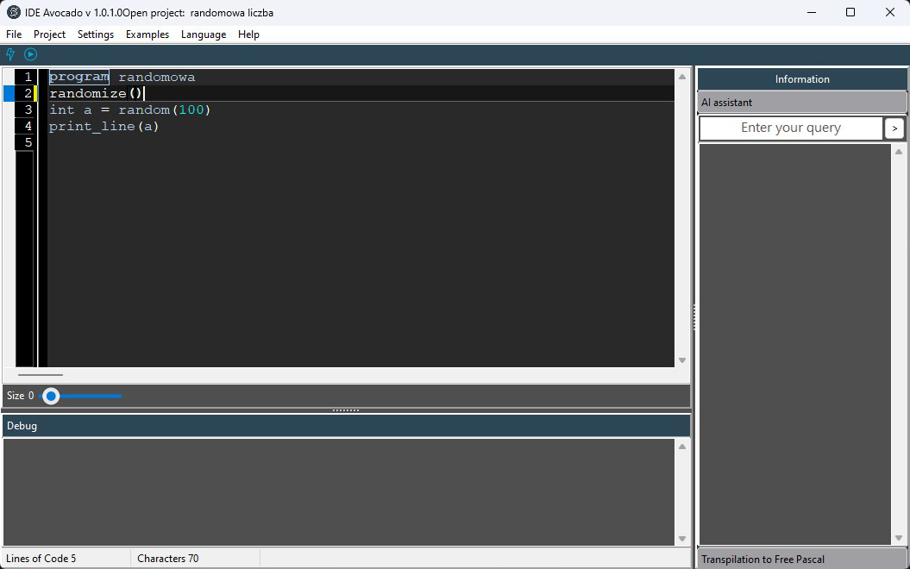
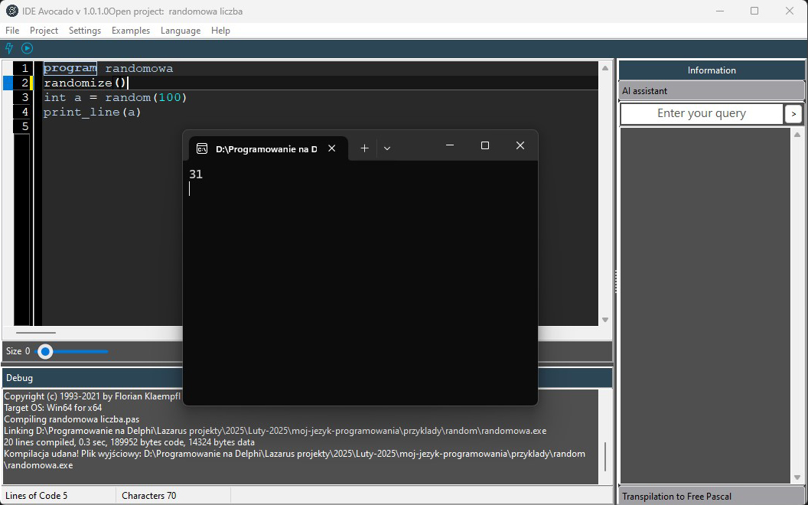
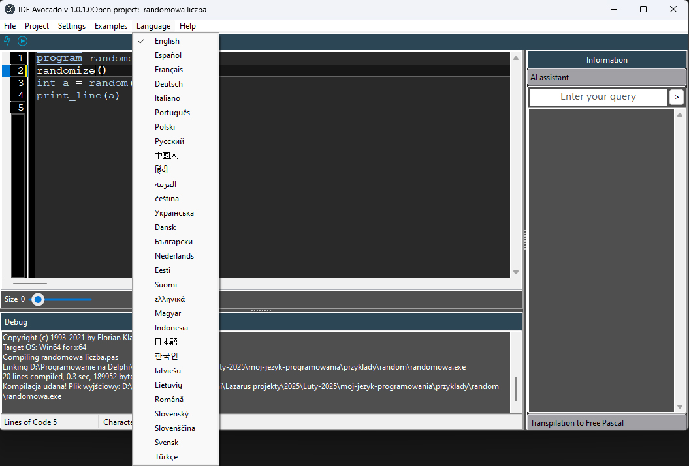
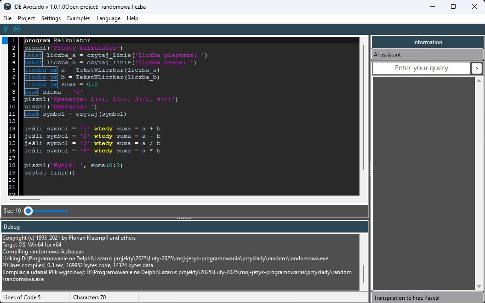
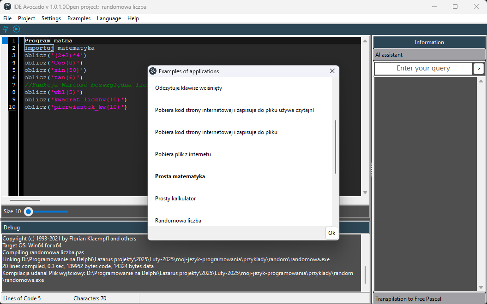
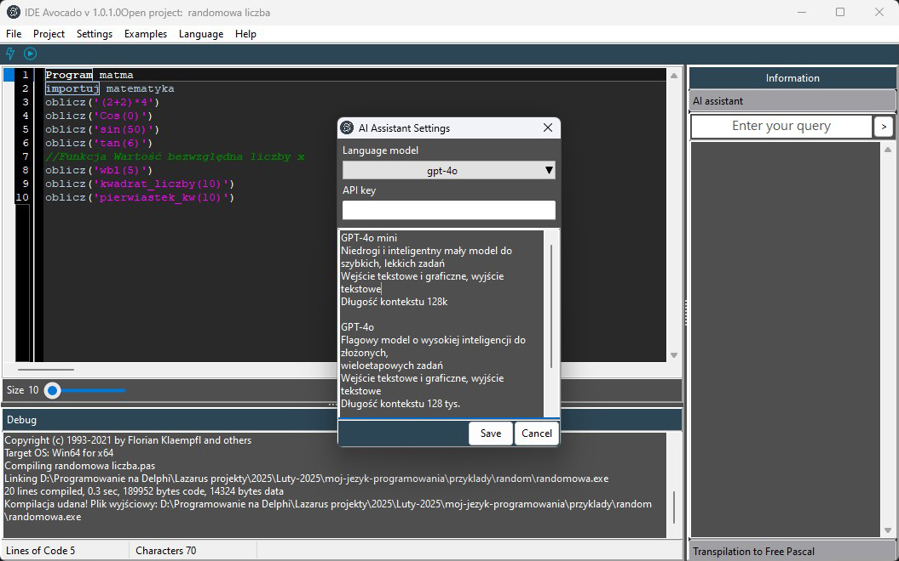

# Avocado
# Avocado - Polish programming language (compiled)
## The Avocado language is compiled and currently allows for the creation of console applications. Work on Avocado and the integrated development environment (IDE) began on 19 February 2025.

## A unique feature of this language is the ability to write commands in Polish and compile code into .exe format. The language is available free of charge for commercial and non-commercial projects. 208 functions have been implemented!

1 Avocado enables the creation of executable applications and provides performance comparable to C or Rust, while maintaining a syntax similar to Python.

# Features
+ Compiled to machine code – achieves speeds comparable to C and Rust.
+ Python-inspired syntax – clear and simple.
+ Polish and English keywords – facilitate learning and work.
+ Free and open – available for commercial and non-commercial projects.
+ Integrated Development Environment (IDE) – facilitates application development.
+ Support for multiple data types – integers, floating point, logical, character, string, array, file...
+ A rich set of type conversion functions – facilitates data operations.
+ Easy to learn – thanks to Polish and English syntax.
+ The Avocado IDE interface has been translated into 30 languages
Polish, English, German, French, Italian, Spanish, Portuguese, Russian, Chinese, Hindi, Arabic, Czech, Ukrainian, Danish, Bulgarian, Dutch, Estonian, Finnish, Greek, Hungarian,  Indonesian, Japanese, Korean, Latvian, Lithuanian, Romanian, Slovak, Slovenian, Swedish, Turkish

### [Documentation](https://avocado.doc.dimitalart.pl/)
### [Official website](https://avocado.dimitalart.pl/) 
### [Download Avocado IDE](https://sourceforge.net/projects/avocado-programming-language/files/Avocado%20Windows%2064%20bits/) 

### Avocado ustawienia

### Avocado available languages 

### Avocado simple calculator

### Avocado application examples

### Avocado settings for the ChatGPT AI assistant

# How to work with Avocado source code
+ ## First, you need to download Lazarus 4.2 or newer. [Link to Lazarus](https://www.lazarus-ide.org/)
+ ## Install the bgracontrols component in Lazarus and rebuild Lazarus.
## In Lazarus, find Package > Online Package Manager in the menu, search for the bgracontrols component, install it, then rebuild the IDE, and everything should work.

## Polish Language
# Avocado - polski język programowania (kompilowany )
## Język Avocado jest kompilowany i aktualnie pozwala na tworzenie aplikacji konsolowych. Prace nad Avocado oraz zintegrowanym środowiskiem programistycznym (IDE) rozpoczęły się 19 lutego 2025 roku.

## Unikalną cechą tego języka jest możliwość pisania komend w języku polskim oraz angielskim, kompilacja kodu do formatu .exe. Język jest dostępny bezpłatnie dla projektów komercyjnych i niekomercyjnych. Zrealizowano 208 funkcji!

1 Avocado umożliwia tworzenie aplikacji wykonywalnych i zapewnia wydajność porównywalną z C lub Rust, przy zachowaniu składni zbliżonej do Pythona.

# Cechy
+ Kompilowany do kodu maszynowego – osiąga szybkość porównywalną z C i Rust.
+ Składnia inspirowana Pythonem – czytelna i prosta.
+ Polskie słowa kluczowe oraz angielksie – ułatwiają naukę i pracę.
+ Bezpłatny i otwarty – dostępny dla projektów komercyjnych i niekomercyjnych.
+ Zintegrowane środowisko programistyczne (IDE) – ułatwia rozwój aplikacji.
+ Obsługa wielu typów danych – całkowitych, zmiennoprzecinkowych, logicznych, znakowych, łańcuchowych, tablicowych, plikowych...
+ Bogaty zestaw funkcji do konwersji typów – ułatwia operacje na danych.
+ Łatwy w nauce – dzięki polskiej i angielskiej składni.
+ Interfejs Avocado IDE został przetłumaczony na 30 języków
polski, angielski, niemiecki, francuski, włoski, hiszpański, portugalski, rosyjski, chiński, hindi, arabski, czeski, ukraiński, duński, bułgarski, holenderski, estoński, fiński, grecki, węgierski, indonezyjski, japoński, koreański, łotewski, litewski, rumuński, słowacki, słoweński, szwedzki, turecki

### [Dokumentacja po polsku](https://avocado.doc.dimitalart.pl/)
### [Oficjalna strona](https://avocado.dimitalart.pl/) 
### [Pobrać IDE Avocado](https://sourceforge.net/projects/avocado-programming-language/files/Avocado%20Windows%2064%20bits/) 

### Avocado ustawienia

### Avocado prykłady apliakcji

### Avocado funkcji matematyczne

### Avocado prosty kalkulator

### Avocado ustawienia pomocnika AI ChatGPT

# Jak pracować z kodem Avocado
+ ## Najpierw trzeba pobrać środowisko Lazarus 4.2 lub nowsze [Link do Lazarus](https://www.lazarus-ide.org/)
+ ## Zainstaluj w Lazarusie komponent bgracontrols i przebuduj Lazarus.
## W Lazarusie w menu znajdź punkt Pakiet > Online Package Manager i wyszukaj komponent bgracontrols i zainstaluj go, potem przebuduj ide i powinno wszystko działać.

