# Avocado
# Avocado - Polish programming language (compiled)
## The Avocado language is compiled and currently allows for the creation of console applications. Work on Avocado and the integrated development environment (IDE) began on 19 February 2025.

## A unique feature of this language is the ability to write commands in Polish and compile code into .exe format. The language is available free of charge for commercial and non-commercial projects. 258 functions have been implemented!

## Avocado enables the creation of executable applications and provides performance comparable to C or Rust, while maintaining a syntax similar to Python.

# Features
+ Compiled to machine code – achieves speeds comparable to C and Rust.
+ Python-inspired syntax – clear and simple.
+ Polish and English keywords – facilitate learning and work.
+ Free and open – available for commercial and non-commercial projects.
+ Integrated Development Environment (IDE) – facilitates application development.
+ Support for multiple data types – integers, floating point, logical, character, string, array, file...
+ A rich set of type conversion functions – facilitates data operations.
+ Easy to learn – thanks to Polish and English syntax.
+ The Avocado IDE interface has been translated into 6 languages
Polish, English, German, French, Spanish, Russian.

## 🥑 Support the Avocado Project

Hey! If you like my **Avocado programming language** project, you can now support its development:  

Every contribution helps me add new features and keep improving Avocado!  
Thank you for all your support and motivation ❤️

### [Polish documentation for the new version Avocado v2.2.0.0](https://avocado.doc.polish.dimitalart.pl/) 
### [Documentation in Polish](https://avocado.doc.dimitalart.pl/)

### [Official website](https://avocado-code.com/) 
### [Replacement page](https://avocado.dimitalart.pl/) 

### [Download Avocado IDE](https://sourceforge.net/projects/avocado-programming-language/files/Avocado%20Windows%2064%20bits/) 

### Avocado Speed ​​Test Compared to Other Languages
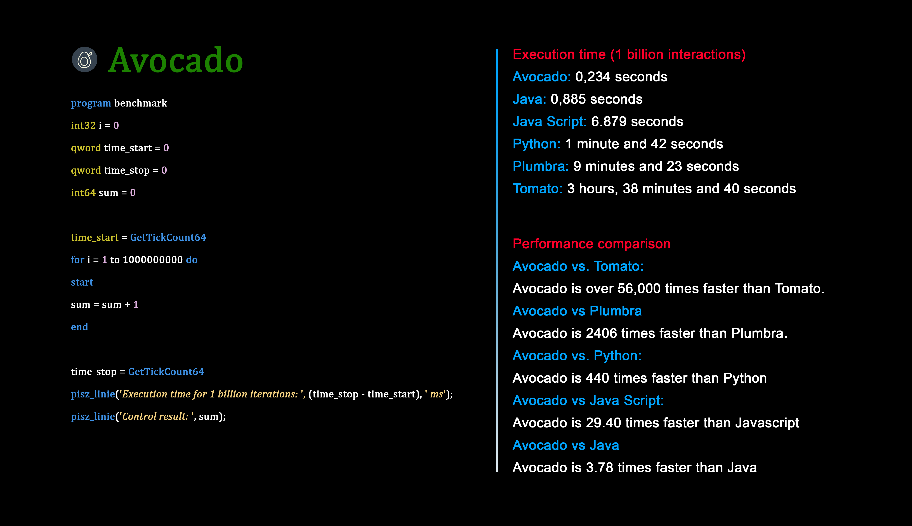

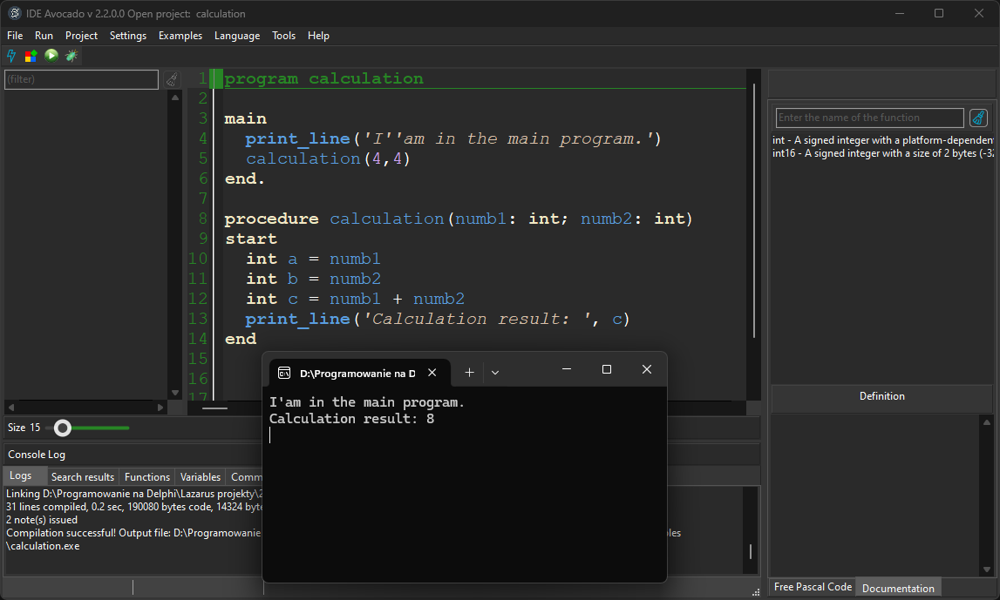
### Avocado available languages 
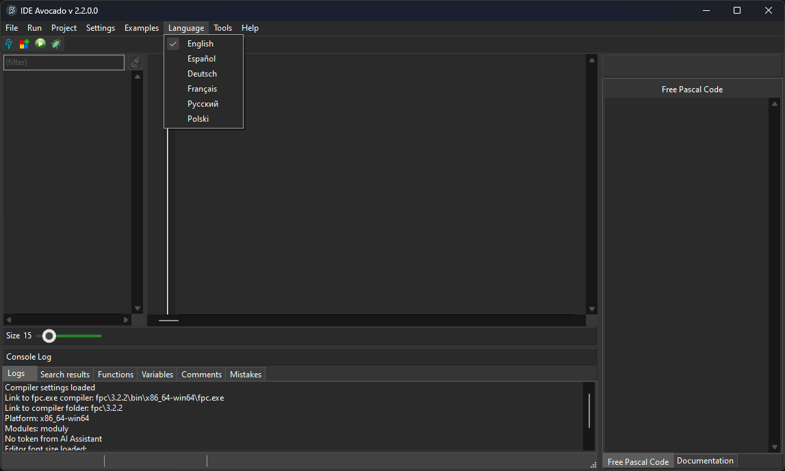

### Writing procedures in Polish
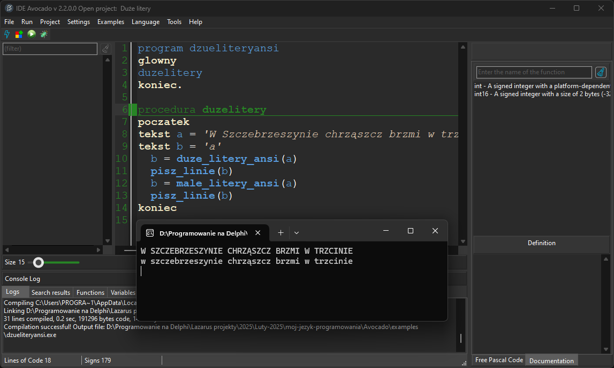

### Writing procedures in English
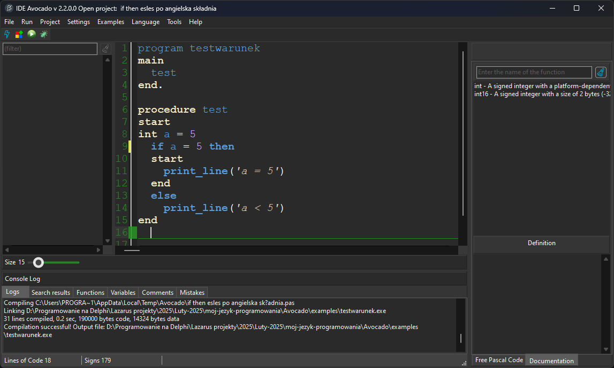

### Writing functions in Polish
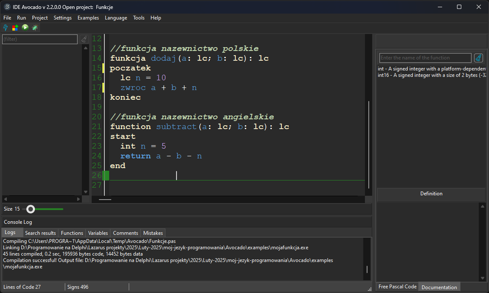

### Compiler Settings in Avocado
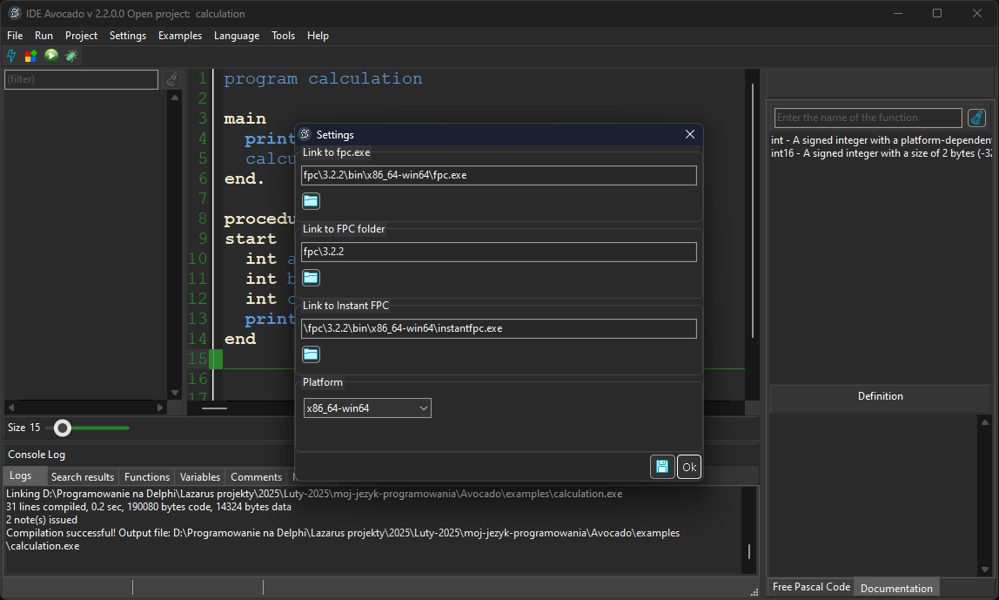

### Sample applications in Avocado
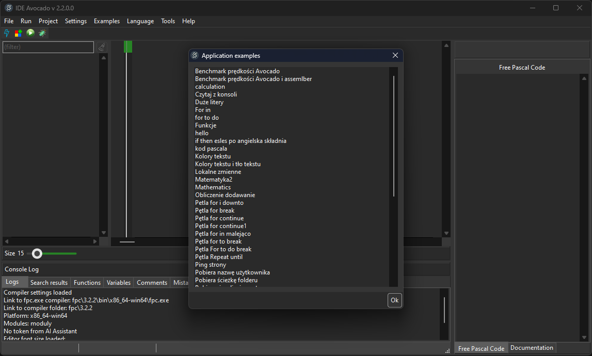

### Temporary project files
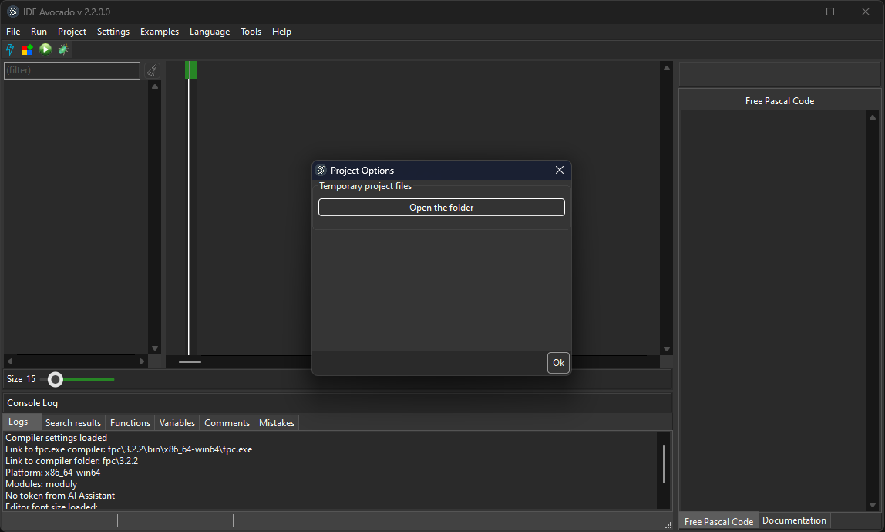

# How to work with Avocado source code
+ ## First, you need to download Lazarus 4.2 or newer. [Link to Lazarus](https://www.lazarus-ide.org/)
+ ## Install the bgracontrols component in Lazarus and rebuild Lazarus.
## In Lazarus, find Package > Online Package Manager in the menu, search for the bgracontrols component, install it, then rebuild the IDE, and everything should work.

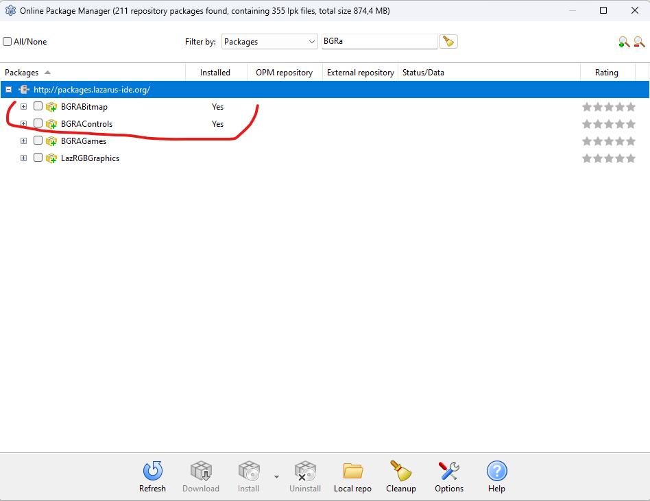
## Install the MetaDarkStyle component in Lazarus and add the metadarkstyledsgn package to the project.
## Installing MetaDarkStyle Package -> Online Package Manager, enter MetaDarkStyle in the field and install it, then rebuild Lazarus.
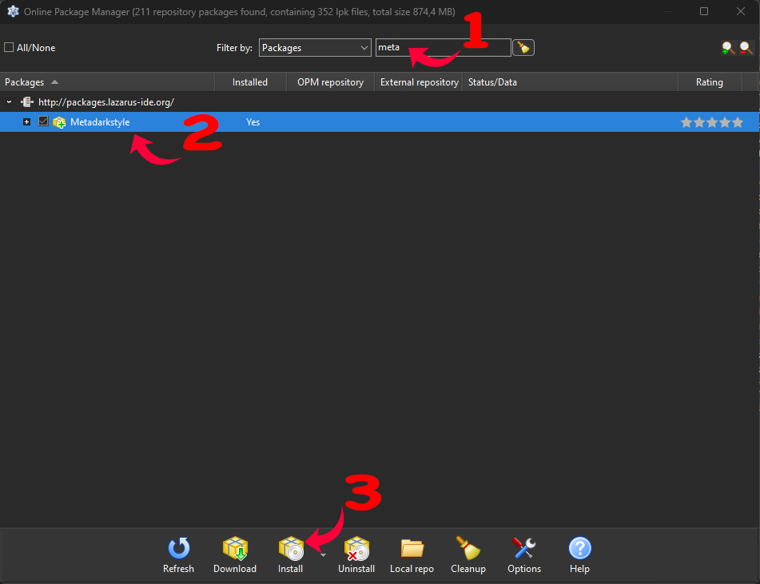
## Add the metadarkstyledsgn package to your project
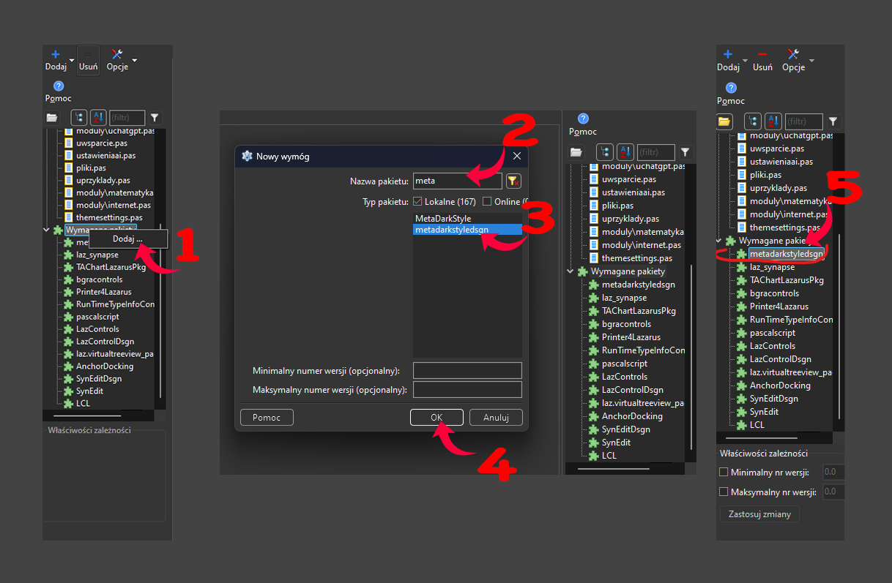

## Polish Language
# Avocado - polski język programowania (kompilowany )
## Język Avocado jest kompilowany i aktualnie pozwala na tworzenie aplikacji konsolowych. Prace nad Avocado oraz zintegrowanym środowiskiem programistycznym (IDE) rozpoczęły się 19 lutego 2025 roku.

## Unikalną cechą tego języka jest możliwość pisania komend w języku polskim oraz angielskim, kompilacja kodu do formatu .exe. Język jest dostępny bezpłatnie dla projektów komercyjnych i niekomercyjnych. Zrealizowano 258 funkcji!

## Avocado umożliwia tworzenie aplikacji wykonywalnych i zapewnia wydajność porównywalną z C lub Rust, przy zachowaniu składni zbliżonej do Pythona.

# Cechy
+ Kompilowany do kodu maszynowego – osiąga szybkość porównywalną z C i Rust.
+ Składnia inspirowana Pythonem – czytelna i prosta.
+ Polskie słowa kluczowe oraz angielskie – ułatwiają naukę i pracę.
+ Bezpłatny i otwarty – dostępny dla projektów komercyjnych i niekomercyjnych.
+ Zintegrowane środowisko programistyczne (IDE) – ułatwia rozwój aplikacji.
+ Obsługa wielu typów danych – całkowitych, zmiennoprzecinkowych, logicznych, znakowych, łańcuchowych, tablicowych, plikowych...
+ Bogaty zestaw funkcji do konwersji typów – ułatwia operacje na danych.
+ Łatwy w nauce – dzięki polskiej i angielskiej składni.
+ Interfejs Avocado IDE został przetłumaczony na 6 języków
polski, angielski, niemiecki, francuski, hiszpański, rosyjski.

## 🥑 Wsparcie projektu Avocado

Hej! Jeśli podoba Ci się mój projekt języka programowania **Avocado**, możesz wesprzeć jego rozwój:  

Każda złotówka pomaga mi dodawać nowe funkcje i rozwijać Avocado!  
Dzięki za każde wsparcie i motywację do dalszej pracy ❤️

### [Dokumentacja po polsku dla nowej wersji Avocado v2.2.0.0 ](https://avocado.doc.polish.dimitalart.pl/) 
### [Dokumentacja po polsku](https://avocado.doc.dimitalart.pl/)

### [Oficjalna strona](https://avocado-code.com/) 
### [Zastępcza strona](https://avocado.dimitalart.pl/)

### [Pobrać IDE Avocado](https://sourceforge.net/projects/avocado-programming-language/files/Avocado%20Windows%2064%20bits/) 

### Test prędkości Avocado na tle innych jezyków
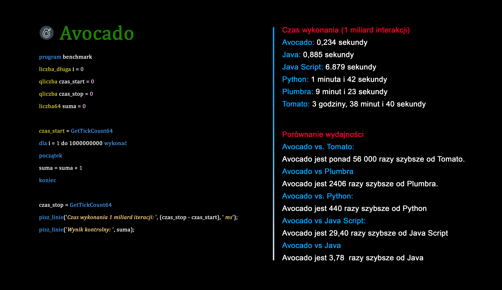

### Przykładowa aplikacja w Avocado

### Avocado dostępne języki 

### Własne procedury po polsku

### Własne procedury po angielsku

### Własne funkcje po polsku i angielsku

### Ustaiwienie ścieżek do kompilatora i interpretatora FPC

### Przykładowe aplikacje w Avocado 48 sztuk

### Tymczasowe pliki projektu

# Jak pracować z kodem Avocado
+ ## Najpierw trzeba pobrać środowisko Lazarus 4.2 lub nowsze [Link do Lazarus](https://www.lazarus-ide.org/)
+ ## Zainstaluj w Lazarusie komponent bgracontrols i przebuduj Lazarus.
## W Lazarusie w menu znajdź punkt Pakiet > Online Package Manager i wyszukaj komponent bgracontrols i zainstaluj go, potem przebuduj ide i powinno wszystko działać.

## Zainstaluj w lazarusie komponent MetaDarkStyle i dodaj pakiet metadarkstyledsgn  do projektu.
## Instalacja MetaDarkStyle Pakiet -> Online Package Managet w polu wpisujemy MetaDarkStyle i instalujemy dalej przebuduj Lazarus.

## Dodaj do projektu pakiet metadarkstyledsgn

